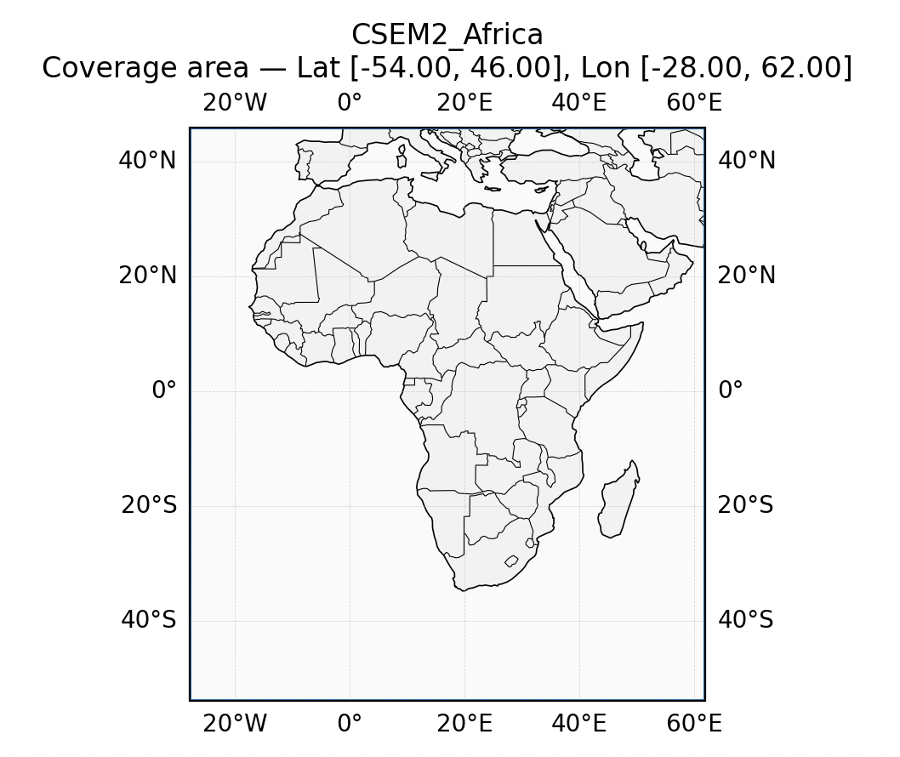
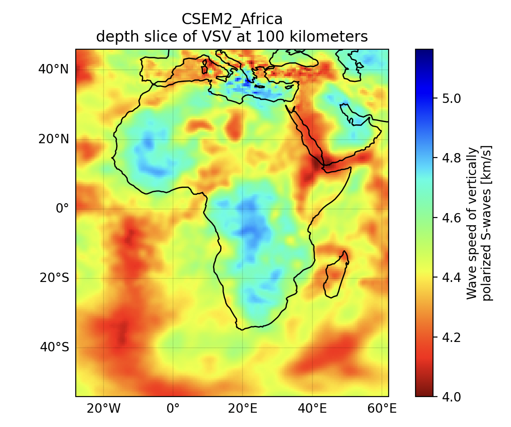

# EMC Explorer User Guide

## Introduction
The **EMC Explorer** is an interactive command-line tool for exploring, visualizing, and exporting Earth model data from NetCDF files. It supports:

- Metadata inspection
- 2D surface plotting
- Depth slices
- Cross-sections
- Geographic map rendering
- Data export in NetCDF, CSV, and GeoCSV formats

---

## 1. Quick Start

```bash
# Download a netCDF file from the EMC File Repository (for example CSEM2-Africa.v2024.12.01.r0.0-n4c.nc)
https://data.dev.earthscope.org/archive/seismology/products/emc/netcdf/CSEM2-Africa.v2024.12.01.r0.0-n4c.nc

# Run the tool
python src/emc_explorer.py -i CSEM2-Africa.v2024.12.01.r0.0-n4c.nc
```

You will see an interactive menu where you can choose tools and actions.

---

## 2. Navigation Basics

At each step, you will be prompted with available actions.  
```
# Some tips for easier navigation.
[TIP] Type 'h' for hints at any prompt.
[TIP] Press Enter to accept default values (if provided)

# The first meu you will see.
[data] select option [meta, range, subset, map, help, exit | h]?

# Type "h" in response to get some hints about the menu items.
Hints
-----
  exit       Quit the tool
  help       Print usage text
  map        Show coverage map (if lat/lon available) <------ 2.1
  meta       View global attributes, coords, and variables <------ 2.2
  range      Show min/max for coords and variables <------ 2.3
  subset     Enter sub-menu: volume/slice/xsection/surface <------ 3
[data] select option [meta, range, subset, map, help, exit | h]?
```

---

### 2.1 Display Map of Coverage Area (`map`)

```
[data] select option [meta, range, subset, map, help, exit | h]? map
```



---

### 2.2 Metadata Inspection (`meta`)
Lists dataset-level attributes and variable metadata.

```
[data] select option [meta, range, subset, map, help, exit | h]? meta

========================================================================
Metadata (3D)
========================================================================

Global attributes (geospatial*)
-------------------------------
  • geospatial_lat_units: degrees_north
  • geospatial_lat_resolution: 2.0
  • geospatial_lon_units: degrees_east
  • geospatial_lon_resolution: 2.0
  • geospatial_vertical_units: km
  • geospatial_vertical_positive: down
  • geospatial_lat_min: -54.0
  • geospatial_lat_max: 46.0
  • geospatial_lon_min: -28.0
  • geospatial_lon_max: 62.0
  • geospatial_vertical_min: 0
  • geospatial_vertical_max: 1200

Coordinate Variables
--------------------
  depth:
  ...
```

### 2.3 Range Inspection (`range`)
Show min/max for coords and variables.

```
[data] select option [meta, range, subset, map, help, exit | h]? range

========================================================================
Ranges (3D)
========================================================================

Coordinate Variables
--------------------
  • depth: 0.00 to 1200.00 kilometers
  • latitude: -54.00 to 46.00 degrees_north
  • longitude: -28.00 to 62.00 degrees_east

Data Variables
--------------
  • VSV: 2.44 to 6.62 km/s
  • VSH: 2.64 to 6.63 km/s
  • VPV: 4.76 to 11.93 km/s
  • VPH: 4.76 to 11.93 km/s
  • RHO: 2024.27 to 4694.88 kg/m^3
```

---

## 3. Tool Reference (`subset`)

```
[subset] select [volume, slice, xsection, back, exit | h]?

  back       Return to main menu
  exit       Quit the tool
  slice      Slice along one coordinate (e.g., depth)  <------ 3.1
  volume     Extract a subvolume (limits for each dimension)
  xsection   Interpolated vertical cross-section along a path  <------ 3.2
```
---

### 3.1 Depth Slice (`slice-depth`)
Plots slices at a given depth (here 100) for 3D variables.

Example:
```
[slice-depth] value (back/exit)? 100 
[TIP] latitude valid range = [-54, 46] (Enter 'min,max' or blank for full)
[slice-depth] latitude limits (back/exit)? <------ press Enter fro full range
[TIP] longitude valid range = [-28, 62] (Enter 'min,max' or blank for full)
[slice-depth] longitude limits (back/exit)? <------ press Enter fro full range
```

Actions available:
- `plot2d` – Depth slice plot
- `plot3d` – 3D rendering
- `gmap` – Geographic overlay <------
- `cmap` – Change colormap
- `save` – Save the slice
[slice-depth] Action [plot2d, plot3d, gmap, cmap, save, back, exit | h]? gmap
[slice-depth] variable ['VSV', 'VSH', 'VS', ...] (back/exit)? VSV

Depth Slice gmap:  


---

### 3.2 Cross-Section (`xsection`)
Plots data along a transect between two points.

Steps:
1. Select a variable.
2. Enter start and end coordinates.
3. Set cross-section width.
4. Choose plotting method.

xsection:  


---

## 4. Saving Data (`save`)

When using `save`, you will be prompted for:
- Output format (NetCDF, CSV, GeoCSV)
- Output filename

Only the currently selected variable subset will be saved.

Example:
```
[save] filename,type (e.g., out,netcdf | back/exit, h)? test,netcdf
```
will save as **test.nc**

---

## 5. Changing Colormaps (`cmap`)

You can type `list` to see all available colormaps.

Example:
```
[cmap] name or 'name,vmin,vmax' (type 'list' to see available cmaps)? list
Available colormaps (170):
magma, inferno, plasma, viridis, ...
```

After listing, you will be prompted again to enter your choice.

---

**Comments or Questions?**  
For any questions or feedback about EMC Earth models or EMC-Tools,  
please email: **[data-help@earthscope.org](mailto:data-help@earthscope.org)**  